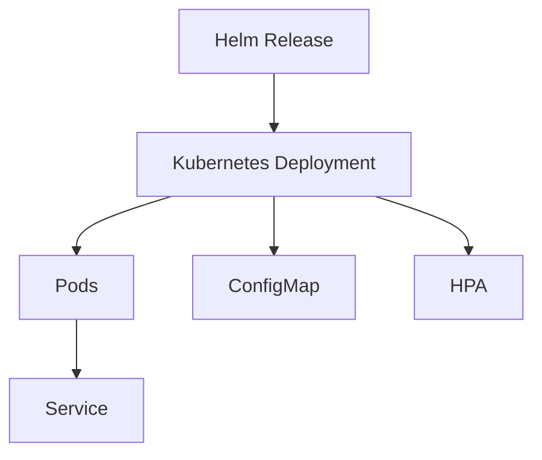

# EKS Helm Deployment

A practical Kubernetes and Helm portfolio project for deploying a containerized web application on Amazon EKS.

This repository demonstrates how DevOps teams can package, deploy, scale, monitor, and roll back Kubernetes workloads using Helm charts and standard Kubernetes resources.

## Tech Stack

| Area | Tools / Services |
|---|---|
| Container Platform | Kubernetes, Amazon EKS |
| Package Management | Helm |
| Deployment | Deployment, Service, ConfigMap |
| Scaling | Horizontal Pod Autoscaler |
| Reliability | Readiness probe, liveness probe, rolling update |
| Operations | kubectl, Helm rollback, troubleshooting commands |

## What This Project Demonstrates

- Helm chart structure for repeatable Kubernetes deployments
- Environment-friendly values configuration
- Kubernetes Deployment with rolling update strategy
- Service exposure inside the cluster
- ConfigMap-based application configuration
- HPA configuration using CPU utilization
- Readiness and liveness probes for safer deployments
- Rollback and production troubleshooting workflow

## Architecture Overview



## Repository Structure

```text
.
├── helm/
│   └── webapp/
│       ├── Chart.yaml
│       ├── values.yaml
│       └── templates/
├── k8s/
│   └── namespace.yaml
├── docs/
│   └── troubleshooting.md
└── README.md
```

## Deploy

```bash
kubectl apply -f k8s/namespace.yaml
helm upgrade --install webapp ./helm/webapp -n devops-demo
kubectl rollout status deployment/webapp-webapp -n devops-demo
```

## Verify

```bash
kubectl get pods -n devops-demo
kubectl get svc -n devops-demo
kubectl get hpa -n devops-demo
kubectl describe deployment webapp-webapp -n devops-demo
```

## Rollback

```bash
helm history webapp -n devops-demo
helm rollback webapp <revision-number> -n devops-demo
```

## Production Improvements

- Use AWS Load Balancer Controller for external traffic
- Store secrets in AWS Secrets Manager or External Secrets Operator
- Add resource tuning based on real CPU and memory metrics
- Add separate values files for dev, stage, and prod
- Add network policies where required
- Add deployment notifications through CI/CD

## Interview Talking Points

This project can be used to explain:

- How Helm helps standardize Kubernetes deployments
- How rolling updates reduce deployment downtime
- How readiness and liveness probes improve reliability
- How HPA scales workloads based on metrics
- How to troubleshoot CrashLoopBackOff, Pending pods, and failed rollouts
- How Helm rollback helps during failed production deployments

## Author

**Sandesh Prabhakar T**  
Senior DevOps Engineer | AWS | EKS | Kubernetes | Helm | Jenkins | Terraform
